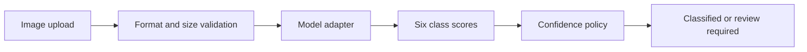

# Architecture

The API layer owns input validation, request tracing and decision policy. The model adapter owns score generation. Keeping those responsibilities separate makes it possible to replace the synthetic adapter with a PyTorch adapter without changing the public response contract.

## Operational safeguards

- Uploads are limited to 5 MiB.
- Only validated JPEG and PNG files reach the adapter.
- Low-confidence predictions are flagged for review.
- The health endpoint states that no production model is loaded.
- Each prediction receives a request ID and timing measurement.

## PyTorch integration point

A future `TorchModelAdapter` would load a versioned checkpoint, apply the exact training preprocessing steps under `torch.inference_mode()`, and return the same six-score mapping. Checkpoint provenance and evaluation results should be documented before that adapter is enabled.
